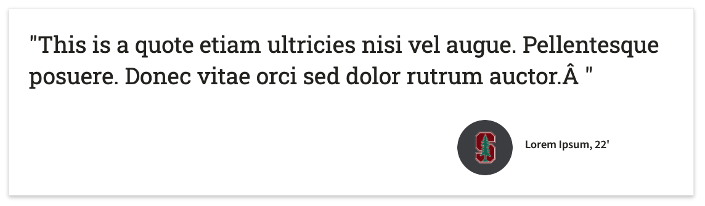

# Spotlight Stories

The spotlight content types can be used in two ways:
- Display a student’s quote
- Display a student’s quote and story

1. Create a spotlight by navigating to All Content > Add Content > Spotlight
2. Fill in all the necessary fields.
3. For Spotlight Quote-only:
    - Input the Author Name in Title field
    - Leave the Caption and Story text fields empty

When relating the spotlight to a specific opportunity, this is how a quote-only spotlight will appear.

4. For Spotlight Stories
    - Input Title
    - Input Author Name
    - Input Caption (optional)
    - Input Story

